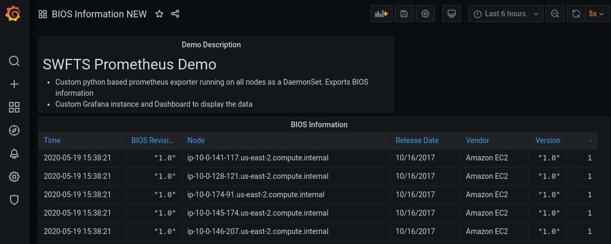

# Prometheus Demo

This project demonstrates the deployment of a custom promethetheus exporter in OpenShift 4.x




## Deploying the Demo

1. Create config map for enabling service monitoring (tech preview).  Wait for prometheus pods to be running 

```
oc apply -f config.yml
watch oc -n openshift-user-workload-monitoring get pod
```

2. Deploy app that exposes metrics (privileged)

```
oc new-project prometheus-demo
oc apply -f build.yml
oc start-build bios-exporter --from-dir=bios-exporter -wF
oc adm policy add-scc-to-user privileged -z default -n prometheus-demo
oc apply -f bios-exporter-app.yml
oc create serviceaccount grafana -n prometheus-demo
oc create clusterrolebinding grafana-cluster-monitoring-view --clusterrole=cluster-monitoring-view --serviceaccount=prometheus-demo:grafana
```

3. Grant the custom cluster role for metrics to any non cluster-admin users, e.g.
```
oc adm policy add-cluster-role-to-user monitor-crd-edit user1
``` 

4. Create alerts
```
oc apply -f app-alerting-rule.yml
```

5. Give view access to a user
```
oc policy add-role-to-user view username  -n prometheus-demo
```

6. Install grafana, data sources and dashboard 
```
sed "s/SERVICE_SECRET/$(oc sa get-token grafana)/g" grafana.yml | oc apply -f -
oc rollout status deployment/grafana
oc expose svc/grafana
```

7. Log in to grafana via the route as admin/admin
```
oc get routes
```
